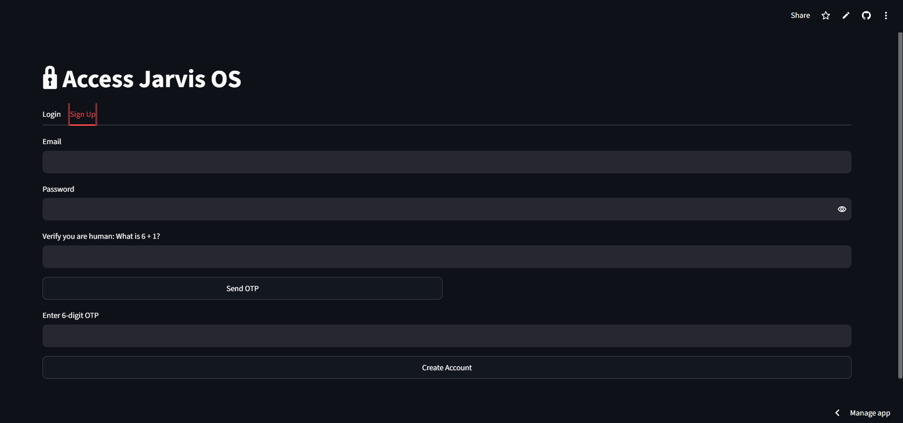
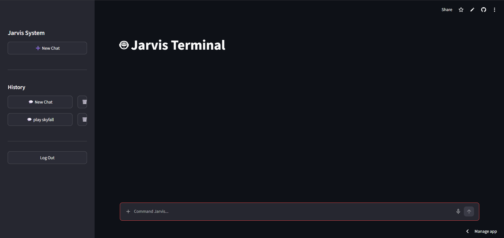

# 🤖 Jarvis AI - Agentic Personal Assistant

[](https://jarvis-personal-assistant.streamlit.app/)
[](https://github.com/ayushjain733/jarvis)
[]()

Jarvis is a highly intelligent, multimodal AI personal assistant built using **LangGraph** and **Gemini 2.5 Flash**. Designed to bridge the gap between cloud-based LLMs and local desktop environments, Jarvis features a modern web interface, voice interaction, persistent memory, and the ability to execute system-level commands on your PC.

---

## 🌟 Key Features

*   **Agentic Brain (LangGraph + Gemini):** Uses dynamic tool-calling to reason through tasks, decide which tools to use, and execute commands efficiently.
*   **Multimodal Capabilities:** Upload `.txt` or `.pdf` files for instant analysis, or ask Jarvis "What am I looking at?" to trigger a screen capture and visual analysis using Gemini Vision.
*   **Persistent Memory:** Powered by a customized `SqliteSaver`, Jarvis remembers your past conversations across different sessions and custom chat threads.
*   **Voice Interface:** Integrates local, ultra-fast STT (Speech-to-Text) using **faster-whisper** and hyper-realistic TTS (Text-to-Speech) using Microsoft **edge-tts**.
*   **Environment-Aware System Control:** When run locally via Ngrok, Jarvis can physically control your PC—opening specific applications, searching your file explorer, and managing system volume. When deployed on the cloud, it dynamically limits system access while retaining core conversational features to prevent server crashes.
*   **Secure Authentication:** Features a custom-built, OTP-based email login system with math-captcha bot protection and SQLite user management.

---

## 📸 Screenshots

*(Add your screenshots here by replacing the placeholder links)*

### Login & Authentication

*Secure email OTP verification and user management.*

### Main Terminal Interface

*Clean, dark-mode terminal with multi-chat session history.*

<!-- ### Local System Execution

*Jarvis opening local folders and identifying screen content.* -->

---

## 🛠️ Tech Stack

*   **Core AI / Logic:** LangChain, LangGraph, Google Gemini 2.5 Flash
*   **Frontend UI:** Streamlit
*   **Audio Processing:** Faster-Whisper (OpenAI), Edge-TTS, Pygame
*   **Database / Auth:** SQLite, Bcrypt, Smtplib
*   **System Tools:** PyAutoGUI, Subprocess, PyPDF

---

## 🚀 Installation & Setup (Local Environment)

To unleash the full capabilities of Jarvis (including local system control), run the application on your own machine.

### 1. Clone the Repository
```bash
git clone [https://github.com/ayushjain733/jarvis.git](https://github.com/ayushjain733/jarvis.git)
cd jarvis
```

### 2. Install Dependencies
```bash
pip install -r requirements.txt
```

### 3. Environment Variables
Create a .env file in the root directory and add your credentials
```bash
GOOGLE_API_KEY=your_gemini_api_key
SMTP_EMAIL=your_gmail_address
SMTP_PASSWORD=your_16_digit_app_password
ENVIRONMENT=local
```

### 4. Run the Application
```bash
streamlit run src/jarvis/ui.py
```

(To access it securely from your phone anywhere in the world, launch it alongside an Ngrok tunnel).

## Author

**Ayush Jain**

[LinkedIn](https://linkedin.com/in/ayush-jain-ba1050253)

[Github](https://github.com/ayushjain733)
